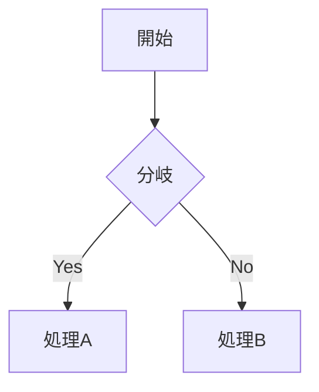

# google-site-markdown-to-clip
VS Code上のMarkdownをGoogle Sitesの埋め込みコードとしてクリップボードにコピーする拡張機能です。

通常のMarkdownに加えて、Mermaidの図もGoogle Sites上でレンダリングできます。

## 使い方

1. VS CodeでMarkdownファイルを開きます。
2. 必要ならMarkdownの一部を選択します（未選択の場合は文書全体が対象です）。
3. コマンドパレット（`Cmd+Shift+P`）から、またはMarkdownエディター上の右クリックメニューから **Copy as Google Sites Markdown** を実行します。
4. 生成されたGoogle Sites用の埋め込みコードがクリップボードにコピーされます。
5. Google Sitesでページを編集し、**埋め込み** → **埋め込みコード**を選択して貼り付けます。

## Mermaid

Markdown内でMermaidのコードブロックを使用できます。

````markdown

````

コピーされるコードには、Markdown変換用のスクリプトに加えてMermaid.jsと描画処理が含まれます。Google Sites上で外部CDNへアクセスできる必要があります。

## コピー対象

- Markdownエディターで範囲を選択している場合は、その範囲だけをコピーします。
- 範囲を選択していない場合は、Markdown文書全体をコピーします。
- Markdown内のバッククォートやテンプレートリテラル構文は、埋め込みスクリプト用に自動でエスケープされます。

## 開発

依存関係をインストール後、`npm run compile` でビルドできます。`npm test` でテストを実行します。
